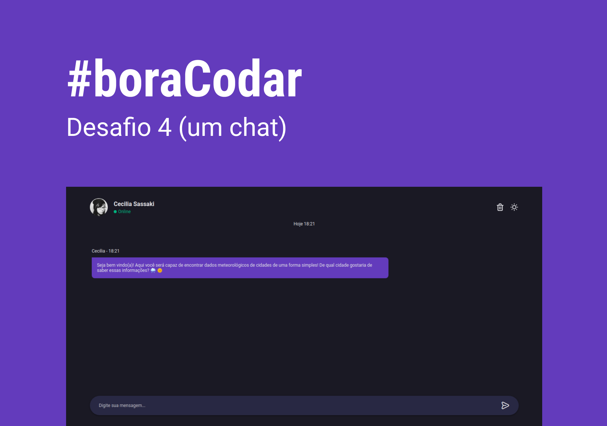

<h1 align="center">
    Chat
</h1>

    <a href="https://www.rocketseat.com.br/boracodar?utm_content=descricao-boracodar_desafio01&utm_term=boracodar&utm_medium=organic&utm_source=youtube&utm_campaign=lead">#boraCodar </a> são desafios semanais, promovido pela Rocketseat para ensino de tecnologias WEB.

  <a href="#objetivo">Objetivo</a>&nbsp;&nbsp;&nbsp;|&nbsp;&nbsp;&nbsp;
  <a href="#tecnologias">Ferramentas</a>&nbsp;&nbsp;&nbsp;|&nbsp;&nbsp;&nbsp;
  <a href="#ideias">Ideias</a>&nbsp;&nbsp;&nbsp;|&nbsp;&nbsp;&nbsp;
  <a href="#projeto">Projeto</a>&nbsp;&nbsp;&nbsp;|&nbsp;&nbsp;&nbsp;
  <a href="#layout">Layout</a>

  

  

<h2 id="objetivo">🚀 <b>Objetivo:</b></h2>

- Desenvolva um chat mobile/desktop, que pode ser responsivo. Você pode ir além e adicionar animações, ou mesmo implementar um chat funcional.

<h2 id="tecnologias">🔧 <b>Ferramentas:</b></h2>

- HTML e CSS
- Javascript
- API da [openweathermap v2.5](https://openweathermap.org/)
- Git e GitHub
- Figma

<h2 id="ideias">💡  <b>Ideias:</b></h2>

- Chat funcional para saber dados metereológicos da cidade que desejas! :)

<h2 id="projeto">💻 <b>Projeto:</b></h2>

- [Veja o projeto online](https://chatweatherapp.netlify.app/)

<h2 id="layout">🎨 <b>Layout:</b></h2>

- [Figma do projeto](https://www.figma.com/community/file/1200070743637495660)

 

  Feito com 💜 por mim | Bruno Souza

