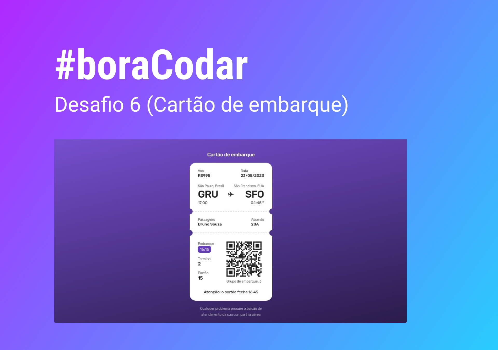

<h1 align="center">
    Cartão de embarque
</h1>

    <a href="https://www.rocketseat.com.br/boracodar?utm_content=descricao-boracodar_desafio01&utm_term=boracodar&utm_medium=organic&utm_source=youtube&utm_campaign=lead">#boraCodar </a> são desafios semanais, promovido pela Rocketseat para ensino de tecnologias WEB.

  <a href="#objetivo">Objetivo</a>&nbsp;&nbsp;&nbsp;|&nbsp;&nbsp;&nbsp;
  <a href="#tecnologias">Ferramentas</a>&nbsp;&nbsp;&nbsp;|&nbsp;&nbsp;&nbsp;
  <a href="#ideias">Ideias</a>&nbsp;&nbsp;&nbsp;|&nbsp;&nbsp;&nbsp;
  <a href="#projeto">Projeto</a>&nbsp;&nbsp;&nbsp;|&nbsp;&nbsp;&nbsp;
  <a href="#layout">Layout</a>

  

  

<h2 id="objetivo">🚀 <b>Objetivo:</b></h2>

- Desenvolva uma tela onde um usuário visualiza um cartão de embarque. Use sua criatividade e fique à vontade para ir além nesse projeto.

<h2 id="tecnologias">🔧 <b>Ferramentas:</b></h2>

- HTML e CSS
- Javascript
- Git e GitHub
- Figma

<h2 id="ideias">💡  <b>Ideias:</b></h2>

- [Web Components](https://developer.mozilla.org/en-US/docs/Web/API/Web_components) 3 (três) componentes customizados criados com JavaScript para reutilização simples. São os seguintes:

  - `<flight-info></flight-info>`: Tag usada para criar a primeira parte (superior) do cartão. Possui as seguintes propriedades:

    - `voo`: Código do voo
    - `data`: Data do voo
    - `departure`: Cidade de partida
    - `departure-airport`: Sigla do aeroporto de partida
    - `boarding-time`: Hora da decolagem
    - `arrival`: Cidade de destino
    - `arrival-airport`: Sigla do aeroporto de destino
    - `arrival-time`: Horário de chegada

  - `<passanger-info></passanger-info>`: Tag usada para criar a segunda parte (central) do cartão. Possui as seguintes propriedades:

    - `passanger`: Nome do passageiro
    - `seat`: Assento no avião

  - `<boarding-info></boarding-info>`: Tag usada para criar a terceira parte (inferior) do cartão. Possui as seguintes propriedades:
    - `boarding-time`: Horário de embarque
    - `terminal`: Terminal de embarque
    - `Gate`: Portão de embarque
    - `src-qr`: Local da imagem do QR Code
    - `alt-qr`: Texto alternativo da imagem
    - `boarding-group`: Grupo de embarque

<h2 id="projeto">💻 <b>Projeto:</b></h2>

- [Veja o projeto online](https://rocketcalculadora.netlify.app/)

<h2 id="layout">🎨 <b>Layout:</b></h2>

- [Figma do projeto](https://www.figma.com/community/file/1205146101173113980)

 

  Feito com 💜 por mim | Bruno Souza

