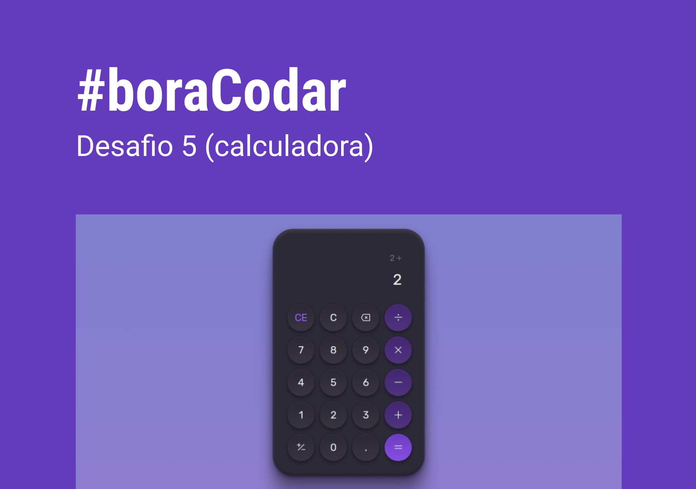

<h1 align="center">
    #boraCodar
</h1>

    Projetos do desafio #boraCodar da Rocketseat 
     
    <a href="https://boracodar.dev">Acesse o desafio desta semana clicando aqui</a>
     
     

<table>
    <thead>
        <tr>
            <th align="center">
                 
                

                    <small>#</small>
                

            </th>
            <th align="center">
                 
                
 
                    <small>
                        TÍTULO
                    </small>
                

            </th>
            <th align="center">
                
                
 
                    <small>
                    DATA
                    </small>
                

            </th>
            <th align="center">
                
                
 
                    <small>
                    CAPA
                    </small>
                

            </th>
        </tr>
    </thead>
    <tbody>
        <tr>
            <td align="center">001</td>
            <td align="center">
                <a href="./001">Player de música</a>
            </td>
            <td align="center">18/03/23</td>
            <td align="center">
                
            </td>
        </tr>
        <tr>
            <td align="center">002</td>
            <td align="center">
                <a href="./002">Card de produto</a>
            </td>
            <td align="center">23/03/23</td>
            <td align="center">
                
            </td>
        </tr>
        <tr>
            <td align="center">003</td>
            <td align="center">
                <a href="./003">Botões e cursores</a>
            </td>
            <td align="center">27/03/23</td>
            <td align="center">
                
            </td>
        </tr>
        <tr>
            <td align="center">004</td>
            <td align="center">
                <a href="./004">Chat</a>
            </td>
            <td align="center">11/04/23</td>
            <td align="center">
                
            </td>
        </tr>
        <tr>
            <td align="center">005</td>
            <td align="center">
                <a href="./005">Calculadora</a>
            </td>
            <td align="center">16/06/23</td>
            <td align="center">
                
            </td>
        </tr>
    </tbody>
</table>
